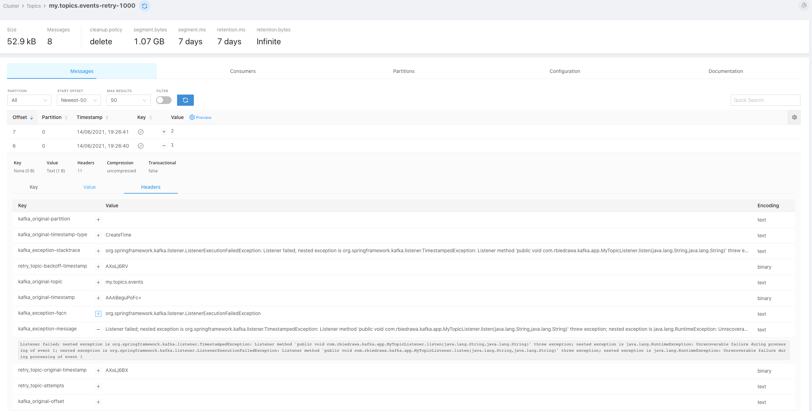

# Non-Blocking Retries in Kafka Consumers (demo)

This repository demonstrates how to handle Kafka Consumer exceptions in a non-blocking manner using retry topics and DLQ (Dead Letter Queue).

## Getting Started

### Prerequisite

* Java 11
* Docker

### Usage

* Start docker-compose.
  ```shell
  docker-compose -f docker/docker-compose.yml up -d
  ```

* Start application.
  ```shell
  ./gradlew bootRun
  ```

* Run below command to produce random messages.
  ```shell
    (cd docker && docker-compose exec broker bash -c "seq 2 | kafka-console-producer --request-required-acks 1 --broker-list localhost:29092 --topic my.topic.events && echo 'Produced 2 messages.'")
    
    # >>>Produced 2 messages.
  ```

* Investigate application logs.
  ```shell
  
  # 2021-06-15 17:20:12.200 [-listener-0-C-1] com.rbiedrawa.kafka.app.MyTopicListener  : Received event 1 from topic my.topic.events
  # 2021-06-15 17:20:12.710 [-listener-0-C-1] o.a.k.clients.consumer.KafkaConsumer     : [Consumer clientId=consumer-my-topic-listener-1, groupId=my-topic-listener] Seeking to offset 3 for partition my.topic.events-0
  # 2021-06-15 17:20:12.711 [etry-1000-0-C-1] o.a.k.clients.consumer.KafkaConsumer     : [Consumer clientId=consumer-my-topic-listener-retry-1000-2, groupId=my-topic-listener-retry-1000] Seeking to offset 2 for partition my.topic.events-retry-1000-0
  # 2021-06-15 17:20:12.711 [etry-1000-0-C-1] essageListenerContainer$ListenerConsumer : Seek to current after exception; nested exception is org.springframework.kafka.listener.ListenerExecutionFailedException: Listener failed; nested exception is org.springframework.kafka.listener.KafkaBackoffException: Partition 0 from topic my.topic.events-retry-1000 is not ready for consumption, backing off for approx. 490 millis.
  # 2021-06-15 17:20:12.720 [-listener-0-C-1] com.rbiedrawa.kafka.app.MyTopicListener  : Received event 2 from topic my.topic.events
  # 2021-06-15 17:20:13.223 [etry-1000-0-C-1] com.rbiedrawa.kafka.app.MyTopicListener  : Received event 1 from topic my.topic.events-retry-1000
  # 2021-06-15 17:20:13.238 [etry-2000-0-C-1] o.a.k.clients.consumer.KafkaConsumer     : [Consumer clientId=consumer-my-topic-listener-retry-2000-3, groupId=my-topic-listener-retry-2000] Seeking to offset 2 for partition my.topic.events-retry-2000-0
  # 2021-06-15 17:20:13.238 [etry-2000-0-C-1] essageListenerContainer$ListenerConsumer : Seek to current after exception; nested exception is org.springframework.kafka.listener.ListenerExecutionFailedException: Listener failed; nested exception is org.springframework.kafka.listener.KafkaBackoffException: Partition 0 from topic my.topic.events-retry-2000 is not ready for consumption, backing off for approx. 1986 millis.
  # 2021-06-15 17:20:13.245 [etry-1000-0-C-1] o.a.k.clients.consumer.KafkaConsumer     : [Consumer clientId=consumer-my-topic-listener-retry-1000-2, groupId=my-topic-listener-retry-1000] Seeking to offset 3 for partition my.topic.events-retry-1000-0
  # 2021-06-15 17:20:13.245 [etry-1000-0-C-1] essageListenerContainer$ListenerConsumer : Seek to current after exception; nested exception is org.springframework.kafka.listener.ListenerExecutionFailedException: Listener failed; nested exception is org.springframework.kafka.listener.KafkaBackoffException: Partition 0 from topic my.topic.events-retry-1000 is not ready for consumption, backing off for approx. 476 millis.
  # 2021-06-15 17:20:13.867 [etry-1000-0-C-1] com.rbiedrawa.kafka.app.MyTopicListener  : Received event 2 from topic my.topic.events-retry-1000
  # 2021-06-15 17:20:15.298 [etry-2000-0-C-1] com.rbiedrawa.kafka.app.MyTopicListener  : Received event 1 from topic my.topic.events-retry-2000
  # 2021-06-15 17:20:15.810 [etry-2000-0-C-1] o.a.k.clients.consumer.KafkaConsumer     : [Consumer clientId=consumer-my-topic-listener-retry-2000-3, groupId=my-topic-listener-retry-2000] Seeking to offset 3 for partition my.topic.events-retry-2000-0
  # 2021-06-15 17:20:15.812 [tener-dlt-0-C-1] com.rbiedrawa.kafka.app.MyTopicListener  : Event 1 handled by dlq topic: my.topic.events-dlt
  # 2021-06-15 17:20:15.819 [etry-2000-0-C-1] o.a.k.clients.consumer.KafkaConsumer     : [Consumer clientId=consumer-my-topic-listener-retry-2000-3, groupId=my-topic-listener-retry-2000] Seeking to offset 3 for partition my.topic.events-retry-2000-0
  # 2021-06-15 17:20:15.819 [etry-2000-0-C-1] essageListenerContainer$ListenerConsumer : Seek to current after exception; nested exception is org.springframework.kafka.listener.ListenerExecutionFailedException: Listener failed; nested exception is org.springframework.kafka.listener.KafkaBackoffException: Partition 0 from topic my.topic.events-retry-2000 is not ready for consumption, backing off for approx. 49 millis.
  # 2021-06-15 17:20:16.326 [etry-2000-0-C-1] com.rbiedrawa.kafka.app.MyTopicListener  : Received event 2 from topic my.topic.events-retry-2000
  # 2021-06-15 17:20:16.841 [tener-dlt-0-C-1] com.rbiedrawa.kafka.app.MyTopicListener  : Event 2 handled by dlq topic: my.topic.events-dlt
  ```

* Open your web browser and go to [Kowl Web UI page](http://localhost:8080/).
    * Check how many consumer groups are active.
      

    * Check kafka topics
      

    * Investigate kafka message headers in retry and dlq topics
      

## Important Endpoints

| Name | Endpoint | 
| -------------:|:--------:|
| `Kowl Web UI` | http://localhost:8080 |

## References

* [Spring Kafka docs - Non-Blocking Retries](https://docs.spring.io/spring-kafka/reference/html/#retry-topic)
* [@RetryableTopic](https://docs.spring.io/spring-kafka/docs/current/api/org/springframework/kafka/annotation/RetryableTopic.html)
* [Uber - Building Reliable Reprocessing and Dead Letter Queues with Apache Kafka](https://eng.uber.com/reliable-reprocessing/)

## License

Distributed under the MIT License. See `LICENSE` for more information.
